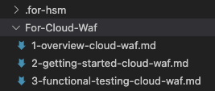
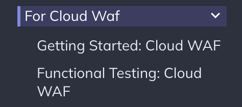
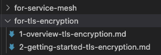
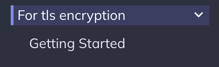
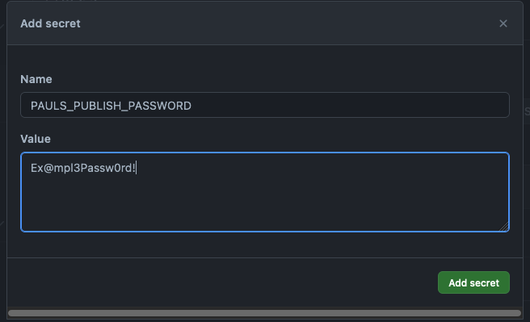

# Venafi Ecosystem Website

Source code for the ecosystem.venafi.com site.

We are using the [Material theme](https://squidfunk.github.io/mkdocs-material/) for [MkDocs](https://www.mkdocs.org/).

## Development Requirements

In order to serve the site locally (useful for editing purposes), you'll need to install the dependencies included in [requirements.txt](/requirements.txt).

**Run locally using:**
```
mkdocs serve
```

**Promote to `gh-pages` branch using:**
```
mkdocs gh-deploy
```
## How Navigation Works

There is one main `nav.md` file at the root of our documentation (`/docs`) with only the top-level defined (developers, tools, engagement, etc.).
The sub-navigation is automatically inferred using any subdirectories/files and we can optionally include another nav.md at each directory level to re-order/rename directories and pages.

When the navigation structure is being built automatically, it will render alphabetically. In order to get it to display in your order without explicitly building a `nav.md` file, you can use numbering  (1-overview, 2-getting-started, 3-suggested tests, 4-submission, 5-etc).

### Directory and File Naming

Section titles are automatically rendered from directory names (including capitalization.)
It's encouraged to keep things consistent by using standard [title case](https://titlecaseconverter.com/rules/) for directories.

Docs pages themselves inherit their title from the `h1` tag (`#`) at the top of each page, so the files themselves can be capitalized or not.

Please use the dash `-` character vs. a "space" `␣` when naming pages and directories for better rendering of the final URL.

| File Structure | Renders as: |
| --- | --- |
|  |  |
|  |  |

## Variables

Variables are used to make future branding updates or name changes easier.
Variable definitions are found in `docs/.variables/general.yml` and can be added to and updated at any point.

> NOTE: To use a variable on any page, simply include it in two curly braces `{{VARIABLE}}`. 

| Markdown | Renders as: |
| --- | --- |
| Venafi is the leader in **{{mim}}**. | Venafi is the leader in **Machine Identity Management**. |

## Snippets

To use a snippet in a topic, create the snippet in 'docs/.snippets' or a subfolder in that directory as a .md file.
Then, in the topics where you want to include the snippet, **you can reference it with the following:**



**To include a snippet in a subfolder, use**



## External Links

Include the following immediately after the (link in parenthesis):
`{: target="_blank" }`

## Protecting Pages

The [`mkdocs-encryptcontent-plugin`](https://github.com/unverbuggt/mkdocs-encryptcontent-plugin) allows us to password-protect certain pages.
You'll need to set an environment variable to set the password securely.
We can't define it at the top of each page directly since we publish the markdown files to a public GitHub repo.

Just add the following to the top of any page and then configure your password as described below.
[Here's an example](/docs/Tools/HSM-Utility/1-usage-hsm-utility.md) of it in action as well.

``` bash
---
use_secret: 'PAULS_PUBLISH_PASSWORD'
---
```

### Local Password

This password is only valid for your local dev environment. Set it using an environment variable before serving the docs.

### Published Password

This password will need to be set using a [GitHub Environment Secret for the github-pages branch](https://github.com/Venafi/ecosystem-docs/settings/environments/634306908/edit).



## Layout & Formatting Options

### Images

All images will automatically get the "lightbox" effect applied to them.
If you'd like to disable this, simply add `{ .off-glb }` immediately after the image:

| Lightbox *enabled* | Lightbox *disabled* |
| --- | --- |
| `[image](path-to-image.png)` | `[image](path-to-image.png){ .off-glb }` |