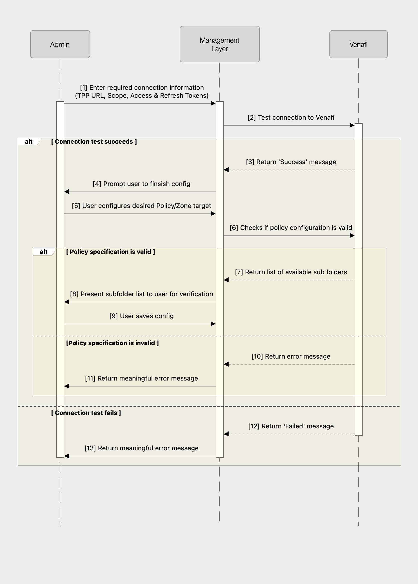

# Additional Resources

The information below may be used for reference purposes while building your solution.

!!! note "Use As Needed"

    It's important to note that not everything below will be applicable for your target use case.
    If it is helpful, great!
    If it isn't applicable, that's okay too!

## Sequence Diagrams

### Initial Configuration

This diagram outlines an example flow for requesting an initial set of access and refresh tokens, along with the required scope from an end user to be stored and utilized by your solution.

### Operation

This diagram outlines an example flow for standard operation of your solution's interaction with Venafi once the initial configuration is complete.

