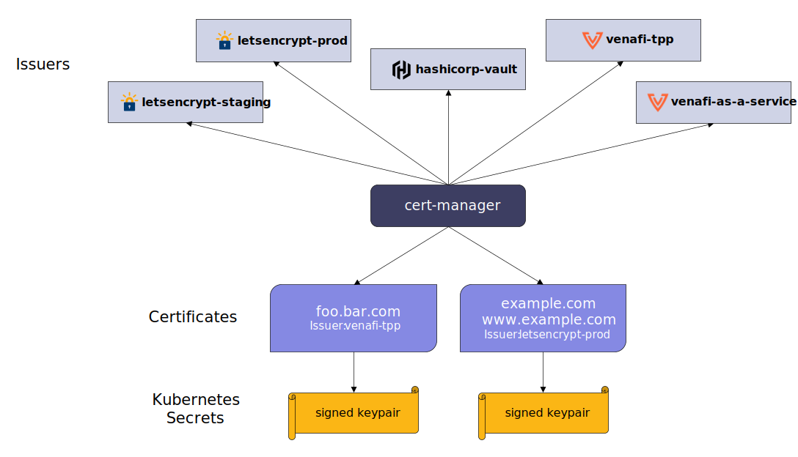

<!-- TODO Should the introduction include: Problem you will solve, What you will build, What the outcome will be, How will it be used. Should this also establish an introduction to the benefits of building for TLS Protect for Kubernetes not just cert-manager, and why you'll want to certify? -->
#  Issuer

**Issuer is a capability of [cert-manager](https://cert-manager.io/) enabling integration with {{mid}} providers. These providers are typically Certificate Authorities which publish digital certificates to secure communication between workloads.**

<!-- TODO TLS Protect for Kubernetes is introduced here along with cert-manager. There's no context on the purpose of either. -->
cert-manager is a critical component in the fight to secure your Kubernetes clusters, helping companies modernize with speed and agility.
{{tlspk}} includes an enterprise-hardened version of cert-manager alongside extensions to support and manage {{mids}} in the enterprise.

## Introduction

The chapter on [Ingress](../../For-Ingress/0-intro-ingress) explains how Kubernetes is broadly unopinionated about the tools you use to fulfill your business demands, such as how you ensure the security of your workloads.
The CNCF's move to accept [cert-manager](https://www.cncf.io/blog/2022/10/19/cert-manager-becomes-a-cncf-incubating-project/) as an incubating project solidifies its reputation as the de-facto Kubernetes solution for stopping outages caused by TLS certificate expiry.

<!-- TODO Who is the 'you[r]'? The developer [who] is building a CA or other machine identity provider. -->
!!! abstract "Design Pattern: Issuer"

    This design pattern focuses on the development of bespoke Issuers for cert-manager.
    The principal concern of any Issuer is to supervise the creation and renewal of {{mids}}.
    This pattern highlights the need to automate everywhere, ensuring that once your solution is deployed it remains in place, **proactively** securing workloads long into the future.

Before you begin, it's important to understand the "what" and "why" of *Issuers* in the context of Kubernetes. 

## What is it?

The Issuer capability in cert-manager extends the Kubernetes API, abstracting away the complexity of {{mid}} providers inside your clusters.
Each Issuer object represents a provider capable of signing and issuing {{mids}}, typically in the form of X.509 certificates.
These providers could be digital security companies you already know and trust, non-profit organizations or just some well-known devices inside your data center.
Each provider brings its own strengths and consumer adoption is determined by various factor such as organizational policy, existing infrastructure, business relationships, individual choice and the task at hand.
In a Kubernetes architecture which prevents misuse and compromise, use of a cert-manager Issuer is a mandatory requirement.

## Why is it necessary?

The following diagram is taken from the cert-manager documentation [homepage](https://cert-manager.io/docs/).

Native Issuer support in cert-manager is currently limited to the {{mid}} providers shown above.
As a developer who needs to extend the reach of cert-manager to provide support for an alternate {{mid}} provider, this design pattern is for you.

## FAQs

Before you proceed there may be a few initial questions that need addressing, for example:

**"What problem will you solve?"**

> {{tlspk}} users need to provide their clusters with a **robust mechanism** for delivery of {{mids}} from your CA's {{mids}}.

**"What will the outcome be?"**

> Automated delivery of {{mids}} from your CA to your Kubernetes clusters and a reduction in **outages** due to certificate expiry.

**"What will you need to deliver?"**

> You solution will be in the form of Kubernetes **controllers and CRDs**. Your images will be sourced from a **public container registry** and installation will be achieved via a **Helm** chart.

**"How will your solution be used?"**

> Automation via your issuer will be initiated through the use of **declarative references** inside cert-manager objects.

**"What about authentication and authorization?"**

> From the perspective of cert-manager there will be zero authentication and authorization requirements, but it will likely be a different story from the perspective of your {{mid}} provider.
  Your solution will need to handle these concerns sensitively and with the agreement of your {{mid}} provider.

**"Why will you want to certify your solution?"**

> Hop over to our [certification section](/Developers/Certification/TLS-Protect-For-Kubernetes/1-tlspk-certification-intro/) for {{tlspk}} to find out more

If you aren't able to find what you're looking for, or have a specific question related to your use case, please [post a question](https://community.venafi.com/ask-the-community-23){: target="_blank" } to the Developer Forum section of Venafi's {{com}} or [email](mailto:support@venafi.com?subject=Developer Question: Issuer) Venafi Customer Support.
