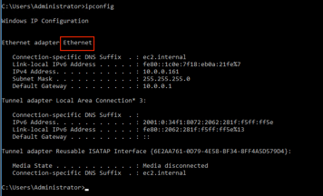

# Using the HSM Validation Utility

!!! warning "Q3 2023 Update!"

    Venafi has changed the behavior of the 'Key Export' functionality.

    - Prior to v23.3 Venafi used RSA as the key transport mechanism for the AES Wrapping Key 
    - We have now added support for ECDH as an option to create the AES Wrapping Key

    **Our preferred order of support is:**
    
    - ECDH using ANSI X9.63
    - RSA using OEAP

## Requirements and Utility Output

[Download the Validation Utility](https://ven-eco.s3.amazonaws.com/downloads/hsm-validation-utility/Pkcs11ValidationTool.zip){ .md-button }

This tool has two dependencies:

1. Working PKCS11 client provided by the Vendor
2. .Net 4.8 on the Windows workstation where it is being run.

This utility has the code logic we use within TPP embedded into it.
It will generate three files:

- `Pkcs11Validation.log` – A running log that captures the output you see on screen
- `Pkcs11 Validation Summary {Date}.txt` – Provides a summary of the tests run and the results
- `(Optional) PKCS11 Trace File` - Will capture PKCS11 calls between Venafi and the HSM client

!!! danger "Saved Password"

    The HSM pin will be recorded in the above files (base64 encoded).
    The assumption is this is a test environment and it does not matter.
    If this is a concern, the password should be scrubbed post run.

## Arguments

| Arguments/Options | Description | Required |
| --- | --- | --- |
| -dl[l]=`<path>` | Path to the cryptoki DLL to use | ✔️ |
| -l[abel]=`<label>` | The label of the partition to test | |
| -se[rial]=`<serial>` | The serial no. of the partition to test | |
| -pi[n]=`<pin>` | The pin to use for authentication | |
| -ty[pe]=`<type>` | The account type to use for authentication (SO, CO, 0 or 1) | |
| -inf[o] | Only print information about the HSM and exit | |
| -des[cription]=`<text>` | Test detail to include in result | |
| -v[ersion] | Print the version of Pkcs11ValidationTool | |
| -n[ame]=`<title>` | Name of the tested device | |
| -k[ey]=`<label>` | Existing AES key to use for tests. If not provided, a new key will be created | |
| -int[erface]=`<name>` | Name of the network interface used to connect to HSM. Used for disconnect test | |
| -q[uiet] | Log only to file, not to screen | |
| -ini[t] | Perform Cryptoki init/finalize/thread protection tests. Must be run separately from all other tests | |
| -as[ym] | Perform asymmetric key usage tests. This tests if the Advanced Key Protect Key Storage feature can be used | |
| -sy[m] | Perform symmetric key usage tests. This tests if the HSM can be used to protect sensitive data in the database | |
| -e[xport] | Test key export. This tests if the Advanced Key Protect Key Generation feature can be used | |
| -der[ive] | Test if the HSM can be used with the Venafi KSP for Microsoft ECDH key derivation | |
| -rn[g] | Test random number generation for use by TPP | |
| -re[connect] | Test reconnecting after network failure. This test will disconnect and reconnect the interface specfied with the 'interface' option while performing crypto operations | |
| -pe[rformance] | Measure number of possible symmetric and asymmetric operations in a given timeframe | |
| -ti[me]=`<seconds>` | Number of seconds to run the performance test. Requires 'performance' option | |
| -th[reads]=`<count>` | Number of threads to use for the performance test. Requires 'performance' option | |
| -w[ait]=`<seconds>` | Number of seconds to wait during reconnect test before re-enabling the network interface | |
| -tr[ace]=`<path>` | Path and filename to use for logging PKCS#11 traffic | |
| -al[l] | Perform all tests | |
| -o[utdir]=`<path>` | The directory to use for writing log and summary files | |

## Example Runs

``` doscon title="Simple Run"
PKCSValidationTool.exe -dll:c:\GemaltoHSM\cryptoki.dll -pin:REMOVED -label:HSMLABEL
```

The following test is only necessary if you want to test performance and reconnect logic.

``` doscon title="Comprehensive Run"
PKCS11ValidationTool.exe -dll:c:\GemaltoHSM\cryptoki.dll -pin:REMOVED -label:HSMLABEL -testall -interface:Ethernet -trace:c:\temp\p11.log
```

!!! warning "Be sure to identify the correct network interface for reconnect tests"

    The reconnect test will disable the network interface during part of the run.
    Please use `ipconfig` to determine the correct network interface to specify when running the reconnect test.

    