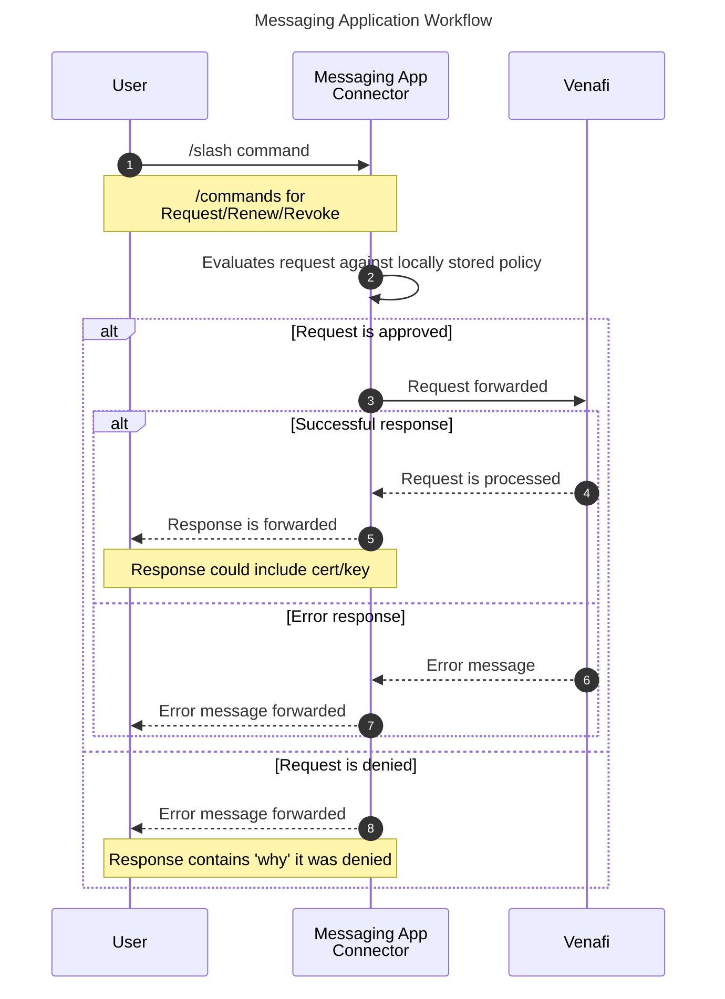

---
puppeteer:
  format: "letter"
---

```mermaid
sequenceDiagram
    autonumber
    title Messaging Application Workflow

    participant U as User
    participant MA as Messaging App<br/>Connector
    participant V as Venafi

    U->>MA: /slash command
    note over U,MA: /commands for<br/>Request/Renew/Revoke

    MA->>MA: Evaluates request against locally stored policy
    alt Request is approved
        MA->>V: Request forwarded
        alt Successful response
            V-->>MA: Request is processed
            MA-->>U: Response is forwarded
            note over U,MA: Response could include cert/key
        else Error response
            V-->>MA: Error message
            MA-->>U: Error message forwarded
        end
    else Request is denied
        MA-->>U: Error message forwarded
        note over U,MA: Response contains 'why' it was denied
    end
```