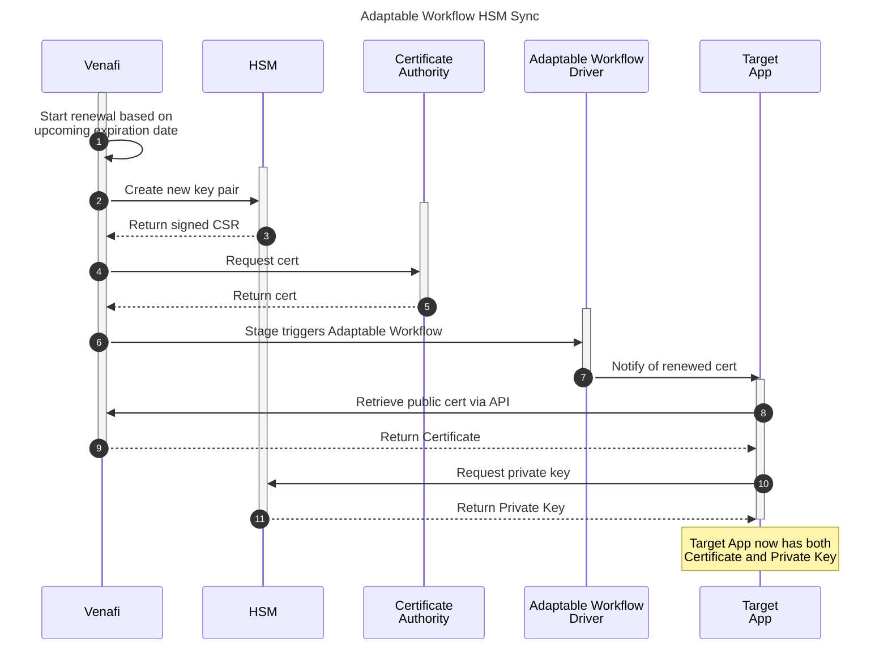

```mermaid
sequenceDiagram
    autonumber
    title Adaptable Workflow HSM Sync

    participant V as Venafi
    participant H as HSM
    participant CA as Certificate<br/>Authority
    participant W as Adaptable Workflow<br/>Driver
    participant T as Target<br/>App

    activate V

    V->>V: Start renewal based on<br/>upcoming expiration date

    activate H

    V->>H: Create new key pair

    activate CA

    H-->>V: Return signed CSR
    V->>CA: Request cert
    CA-->>V: Return cert

    deactivate CA
    activate W

    V->>W: Stage triggers Adaptable Workflow
    W->>T: Notify of renewed cert

    deactivate W
    activate T

    T->>V: Retrieve public cert via API
    V-->>T: Return Certificate

    deactivate V

    T->>H: Request private key
    H-->>T: Return Private Key

    deactivate H
    deactivate T

    note over T: Target App now has both<br/>Certificate and Private Key
```