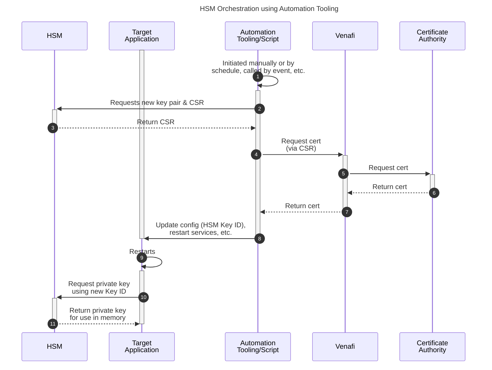

```mermaid
sequenceDiagram
  autonumber
  title HSM Orchestration using Automation Tooling

  participant HSM
  participant TA as Target <br/> Application
  participant AT as Automation <br/> Tooling/Script
  participant V as Venafi
  participant CA as Certificate <br/> Authority

  activate TA

  AT->>+AT: Initiated manually or by <br/> schedule, called by event, etc.
  AT->>+HSM: Requests new key pair & CSR
  
  HSM-->>-AT: Return CSR
  AT->>+V: Request cert <br/> (via CSR)
  V->>+CA: Request cert
  CA-->>-V: Return cert
  V-->>-AT: Return cert
  AT->>-TA: Update config (HSM Key ID), <br/> restart services, etc.
  deactivate TA
  TA->>TA: Restarts
  
  activate TA
  TA->>+HSM: Request private key <br/> using new Key ID
  HSM-->>-TA: Return private key <br/> for use in memory

  deactivate TA

```