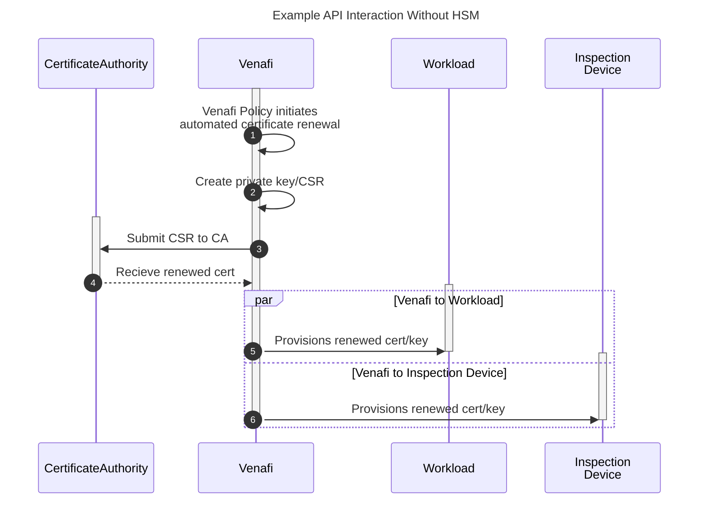

```mermaid
sequenceDiagram
    autonumber
    title Example API Interaction Without HSM

    participant CA as CertificateAuthority
    participant V as Venafi
    participant W as Workload
    participant ID as Inspection <br/> Device

    activate V
    V->>V: Venafi Policy initiates<br/>automated certificate renewal
    V->>V: Create private key/CSR

    activate CA
    V->>CA: Submit CSR to CA
    CA-->>V: Recieve renewed cert
    deactivate CA

    activate W
    par Venafi to Workload
    V->>W: Provisions renewed cert/key
    deactivate W
    activate ID
    and Venafi to Inspection Device
    V->>ID: Provisions renewed cert/key
    deactivate ID
    deactivate V
    end
```