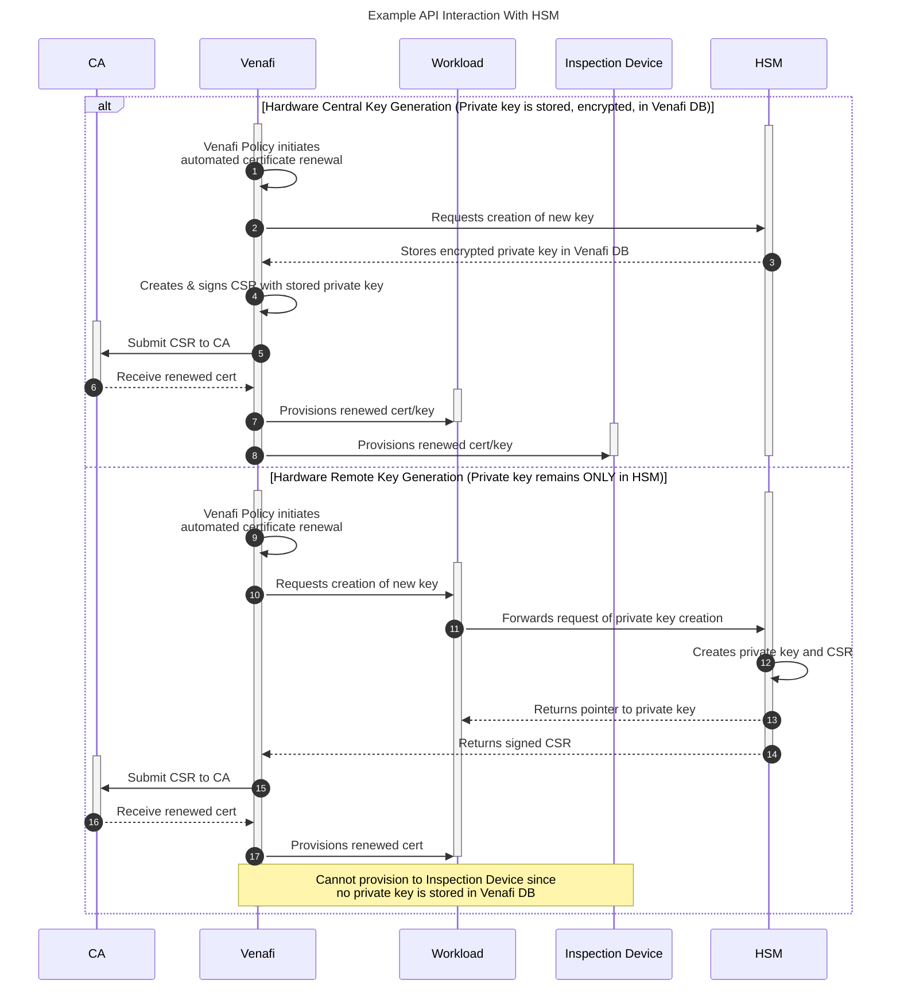

```mermaid
sequenceDiagram
    autonumber
    title Example API Interaction With HSM

    participant CA as CA
    participant V as Venafi
    participant W as Workload
    participant ID as Inspection Device
    participant HSM

    alt Hardware Central Key Generation (Private key is stored, encrypted, in Venafi DB)
        activate V
        activate HSM
        V->>V: Venafi Policy initiates<br/>automated certificate renewal
        V->>HSM: Requests creation of new key
        HSM-->>V: Stores encrypted private key in Venafi DB
        V->>V: Creates & signs CSR with stored private key

        activate CA
        V->>CA: Submit CSR to CA
        CA-->>V: Receive renewed cert
        deactivate CA

        activate W
        V->>W: Provisions renewed cert/key
        deactivate W

        activate ID
        V->>ID: Provisions renewed cert/key
        deactivate ID
        deactivate V
        deactivate HSM

    else Hardware Remote Key Generation (Private key remains ONLY in HSM)
        activate V
        activate HSM
        V->>V: Venafi Policy initiates<br/>automated certificate renewal
        activate W
        V->>W: Requests creation of new key
        W->>HSM: Forwards request of private key creation
        HSM->>HSM: Creates private key and CSR
        HSM-->>W: Returns pointer to private key
        HSM-->>V: Returns signed CSR
        deactivate HSM

        activate CA
        V->>CA: Submit CSR to CA
        CA-->>V: Receive renewed cert
        deactivate CA

        V->>W: Provisions renewed cert
        deactivate W

        note over V,ID: Cannot provision to Inspection Device since<br/>no private key is stored in Venafi DB
        deactivate V
    end
```