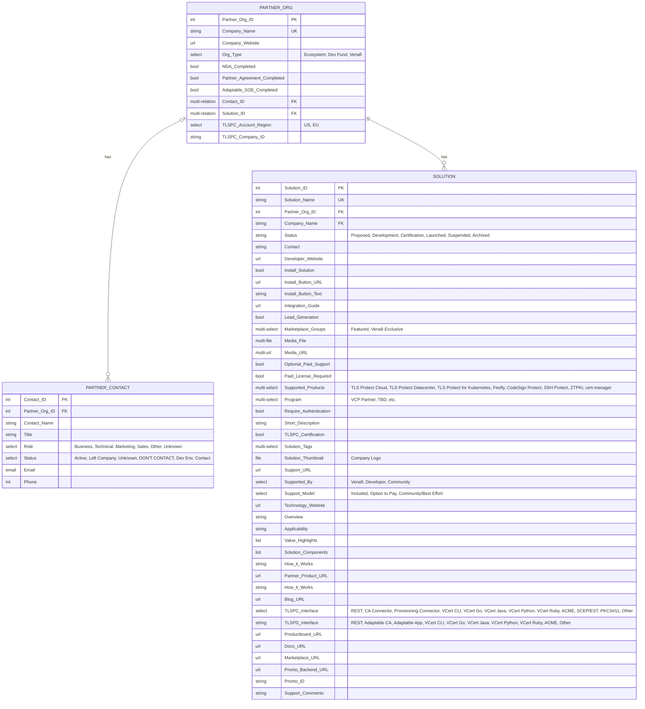

```mermaid
erDiagram
    PARTNER_ORG |o--o{ PARTNER_CONTACT : has
    PARTNER_ORG ||--o{ SOLUTION : has
    
    PARTNER_ORG {
        int  Partner_Org_ID PK
        string Company_Name UK
        url Company_Website
        select Org_Type "Ecosystem, Dev Fund, Venafi"
        bool NDA_Completed
        bool Partner_Agreement_Completed
        bool Adaptable_SOE_Completed
        multi-relation Contact_ID FK
        multi-relation Solution_ID FK
        select TLSPC_Account_Region "US, EU"
        string TLSPC_Company_ID
    }

    PARTNER_CONTACT {
        int Contact_ID PK
        int Partner_Org_ID FK
        string Contact_Name
        string Title
        select Role "Business, Technical, Marketing, Sales, Other, Unknown"
        select Status "Active, Left Company, Unknown, DON'T CONTACT, Dev Env. Contact"
        email Email
        int Phone
    }

    SOLUTION {
        int Solution_ID PK
        string Solution_Name UK
        int Partner_Org_ID FK
        string Company_Name FK
        string Status "Proposed, Development, Certification, Launched, Suspended, Archived"
        string Contact
        url Developer_Website
        bool Install_Solution
        url Install_Button_URL
        string Install_Button_Text
        url Integration_Guide
        bool Lead_Generation
        multi-select Marketplace_Groups "Featured, Venafi Exclusive"
        multi-file Media_File
        multi-url Media_URL
        bool Optional_Paid_Support
        bool Paid_License_Required
        multi-select Supported_Products "TLS Protect Cloud, TLS Protect Datacenter, TLS Protect for Kubernetes, Firefly, CodeSign Protect, SSH Protect, ZTPKI, cert-manager"
        multi-select Program "VCP Partner, TBD, etc."
        bool Require_Authentication
        string Short_Description
        bool TLSPC_Certification
        multi-select Solution_Tags
        file Solution_Thumbnail "Company Logo"
        url Support_URL
        select Supported_By "Venafi, Developer, Community"
        select Support_Model "Included, Option to Pay, Community/Best Effort"
        url Technology_Website
        string Overview
        string Applicability
        list Value_Highlights
        list Solution_Components
        string How_it_Works
        url Partner_Product_URL
        string How_it_Works
        url Blog_URL
        select TLSPC_Interface "REST, CA Connector, Provisioning Connector, VCert CLI, VCert Go, VCert Java, VCert Python, VCert Ruby, ACME, SCEP/EST, PKCS#11, Other"
        string TLSPD_Interface "REST, Adaptable CA, Adaptable App, VCert CLI, VCert Go, VCert Java, VCert Python, VCert Ruby, ACME, Other"
        url Productboard_URL
        url Docs_URL
        url Marketplace_URL
        url Pronto_Backend_URL
        string Pronto_ID
        string Support_Comments
        }

```
