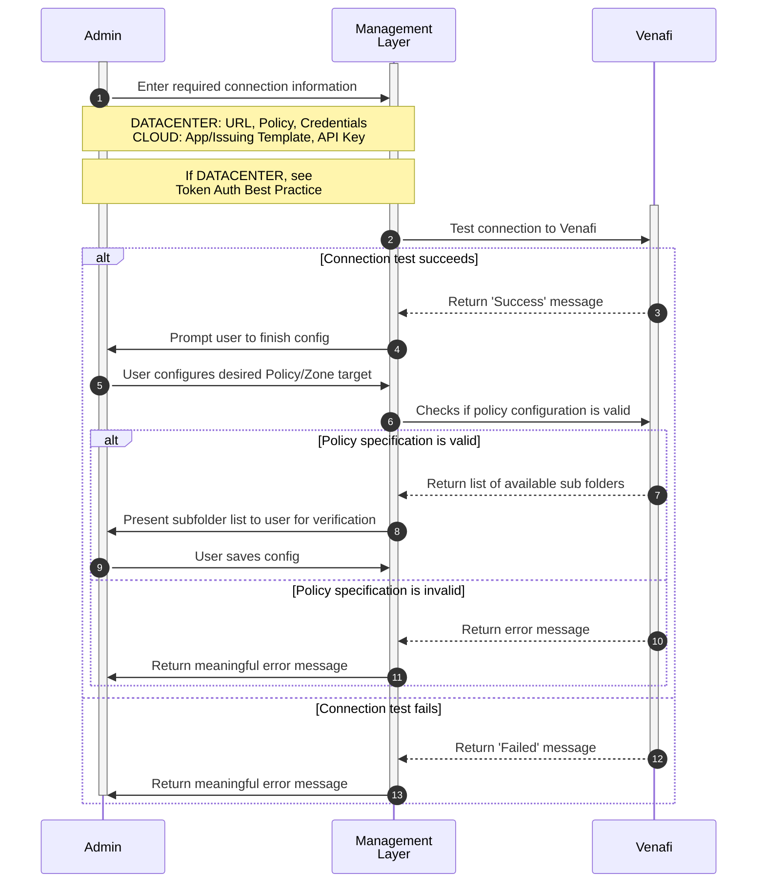

```mermaid
sequenceDiagram
    autonumber
    participant A as Admin
    participant ML as Management<br/>Layer
    participant V as Venafi

    activate A
    activate ML

    A->>ML: Enter required connection information

    note over A,ML: DATACENTER: URL, Policy, Credentials<br/>CLOUD: App/Issuing Template, API Key

    note over A,ML: If DATACENTER, see<br/>Token Auth Best Practice


    activate V
    ML->>V: Test connection to Venafi
    alt Connection test succeeds
        V-->>ML: Return 'Success' message
        ML->>A: Prompt user to finish config
        A->>ML: User configures desired Policy/Zone target
        ML->>V: Checks if policy configuration is valid
        alt Policy specification is valid
            V-->>ML: Return list of available sub folders
            ML->>A: Present subfolder list to user for verification
            A->>ML: User saves config
        else Policy specification is invalid
            V-->>ML: Return error message
            ML->>A: Return meaningful error message
        end
    else Connection test fails
        V-->>ML: Return 'Failed' message
        deactivate V
        ML->>A: Return meaningful error message
        deactivate ML
        deactivate A
    end
```