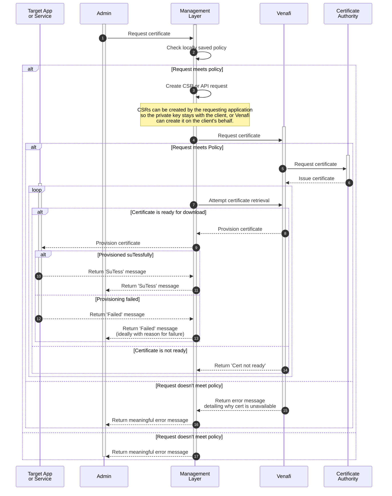

```mermaid
sequenceDiagram
    autonumber
    participant T as Target App<br/>or Service
    participant A as Admin
    participant ML as Management<br/>Layer
    participant V as Venafi
    participant CA as Certificate<br/>Authority

    activate A
    activate ML

    A->>ML: Request certificate

    ML->>ML: Check locally saved policy
    alt Request meets policy
        ML->>ML: Create CSR or API request
        note over ML: CSRs can be created by the requesting application<br/>so the private key stays with the client, or Venafi<br/>can create it on the client's behalf.
        
        activate V
        ML->>V: Request certificate
        
        alt Request meets Policy
            activate CA
            V->>CA: Request certificate
            CA-->>V: Issue certificate
            deactivate CA
            activate T
            
            loop
                ML->>V: Attempt certificate retrieval
                
                alt Certificate is ready for download
                    V-->>ML: Provision certificate
                    ML-->>T: Provision certificate
                    
                    alt Provisioned suTessfully
                        T-->>ML: Return 'SuTess' message
                        ML-->>A: Return 'SuTess' message
                    else Provisioning failed
                        T-->>ML: Return 'Failed' message
                        deactivate T
                        ML-->>A: Return 'Failed' message<br/>(ideally with reason for failure)
                    end
                else Certificate is not ready
                    V-->>ML: Return 'Cert not ready'
                end
            end
        else Request doesn't meet policy
            V-->>ML: Return error message<br/>detailing why cert is unavailable
            deactivate V
            ML-->>A: Return meaningful error message
        end
    else Request doesn't meet policy
        ML-->>A: Return meaningful error message
        deactivate ML
        deactivate A
    end
```