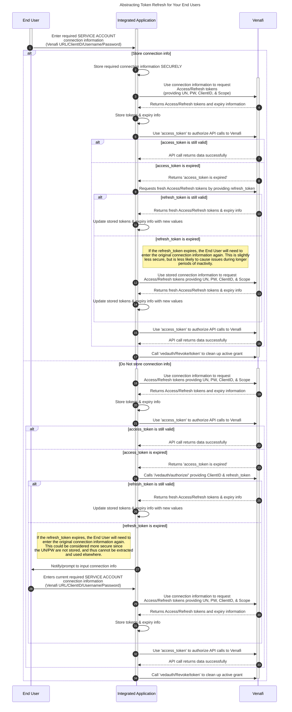

```mermaid
sequenceDiagram
    autonumber
    title Abstracting Token Refresh for Your End Users

    participant EU as End User
    participant IA as Integrated Application
    participant V as Venafi

    activate EU
    activate IA

    EU->>IA: Enter required SERVICE ACCOUNT <br/> connection information<br/>(Venafi URL/ClientID/Username/Password)

    deactivate EU

    alt Store connection info

        IA->>IA: Store required connection information SECURELY

        activate V

        IA->>V: Use connection information to request<br/>Access/Refresh tokens <br/> (providing UN, PW, ClientID, & Scope)
        V-->>IA: Returns Access/Refresh tokens and expiry information
        IA->>IA: Store tokens & expiry info

        IA->>V: Use 'access_token' to authorize API calls to Venafi
        alt access_token is still valid
            V-->>IA: API call returns data successfully
        else access_token is expired
            V-->>IA: Returns 'access_token is expired'
            IA->>V: Requests fresh Access/Refresh tokens by providing refresh_token
            alt refresh_token is still valid
                V-->>IA: Returns fresh Access/Refresh tokens & expiry info
                IA->>IA: Update stored tokens & expiry info with new values
            else refresh_token is expired
                note right of IA: If the refresh_token expires, the End User will need to<br/> enter the original connection information again. This is slightly<br/> less secure, but is less likely to cause issues during longer <br/>periods of inactivity.
                IA->>V: Use stored connection information to request<br/>Access/Refresh tokens providing UN, PW, ClientID, & Scope
                V-->>IA: Returns fresh Access/Refresh tokens & expiry info
                IA->>IA: Update stored tokens & expiry info with new values
            end
            IA->>V: Use 'access_token' to authorize API calls to Venafi
            V-->>IA: API call returns data successfully
        end

        IA->>V: Call 'vedauth/Revoke/token' to clean up active grant

        deactivate IA
        deactivate V

    else Do Not store connection info

        activate V
        activate IA

        IA->>V: Use connection information to request<br/>Access/Refresh tokens providing UN, PW, ClientID, & Scope
        V-->>IA: Returns Access/Refresh tokens and expiry information
        IA->>IA: Store tokens & expiry info

        IA->>V: Use 'access_token' to authorize API calls to Venafi
        alt access_token is still valid
            V-->>IA: API call returns data successfully
        else access_token is expired
            V-->>IA: Returns 'access_token is expired'
            IA->>V: Calls '/vedauth/authorize/' providing ClientID & refresh_token
            alt refresh_token is still valid
                V-->>IA: Returns fresh Access/Refresh tokens & expiry info
                IA->>IA: Update stored tokens & expiry info with new values
            else refresh_token is expired
                note left of IA: If the refresh_token expires, the End User will need to<br/> enter the original connection information again. <br/> This could be considered more secure since <br/> the UN/PW are not stored, and thus cannot be extracted <br/>and used elsewhere.
                IA->>EU: Notify/prompt to input connection info
                EU->>IA: Enters current required SERVICE ACCOUNT<br/>connection information<br/>(Venafi URL/ClientID/Username/Password)
                IA->>V: Use connection information to request<br/>Access/Refresh tokens providing UN, PW, ClientID, & Scope
                V-->>IA: Returns Access/Refresh tokens and expiry information
                IA->>IA: Store tokens & expiry info
            end
            IA->>V: Use 'access_token' to authorize API calls to Venafi
            V-->>IA: API call returns data successfully
        end

        IA->>V: Call 'vedauth/Revoke/token' to clean up active grant

        deactivate IA
        deactivate V
    end
```