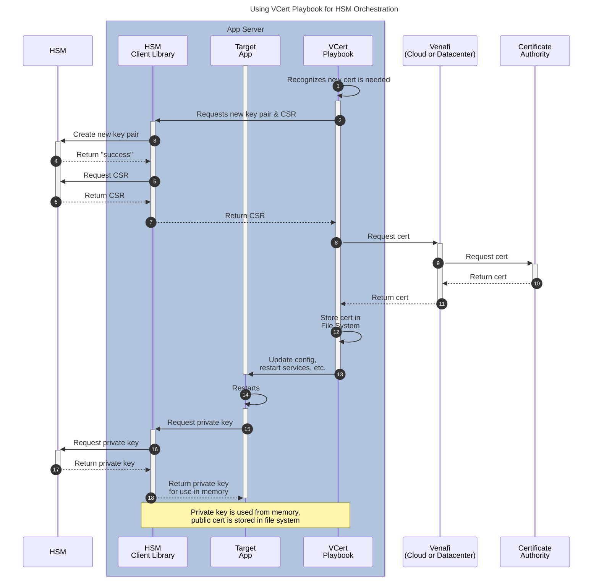

```mermaid
sequenceDiagram
  autonumber
  title Using VCert Playbook for HSM Orchestration

  participant HSM
  box LightSteelBlue App Server
    participant HC as HSM <br/> Client Library
    participant TA as Target <br/> App
    participant VC as VCert <br/> Playbook
  end
  participant V as Venafi <br/> (Cloud or Datacenter)
  participant CA as Certificate <br/> Authority


  activate TA
  
  VC->>+VC: Recognizes new cert is needed
  VC->>+HC: Requests new key pair & CSR
  HC->>+HSM: Create new key pair
  HSM-->>HC: Return "success"
  HC->>HSM: Request CSR
  HSM-->>-HC: Return CSR
  HC-->>-VC: Return CSR
  VC->>+V: Request cert
  V->>+CA: Request cert
  CA-->>-V: Return cert
  V-->>-VC: Return cert
  VC->>VC: Store cert in <br/> File System
  VC->>-TA: Update config, <br/> restart services, etc.
  deactivate TA
  TA->>TA: Restarts
  
  activate TA
  TA->>+HC: Request private key
  HC->>+HSM: Request private key 
  HSM-->>-HC: Return private key 
  HC-->>-TA: Return private key <br/> for use in memory

  deactivate TA
  note over HC,VC: Private key is used from memory, <br/> public cert is stored in file system

```