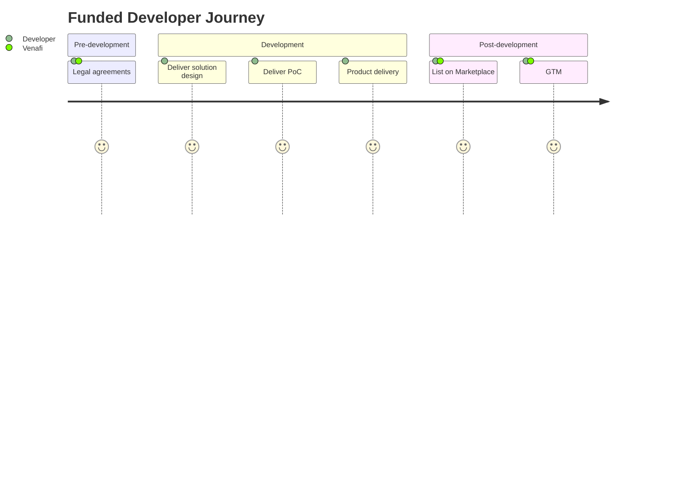

Technology is advancing faster than ever before, software development is going faster, innovation is driven to go with a faster speed. To help with **fastsecure** with machine identity management, Venafi established a $12.5 million Development Fund to bring to life new integrated solutions for DevOps, cloud-native, microservices, IoT and beyond.  

Under the management of Venafi Ecosystem, we seek for innovation that identifies and develops new design patterns, finds new ways of solving problems, and builds new business models.

In addition to traditional parnter Developers, we extend our offer to the following types of Developers.

### Venafi IndieDevs
Individual developers make a unique contribution to the open-source community and will provide Venafi customers with cutting edge solutions in the machine identity management space.

### Venafi UniversityDevs
Venafi has partnered with Oxford University and Carnegie Mellon University to investigate machine identity management innovations and create new open-source solutions.

## Process
Replace this with an external graph

A typical journey for a Developer joining the program is as follows: 

## Principles
1. Venafi **does not dictate** the speed of your progress 
2. We **do not impose on any timeline** for the completion of each milestone or the project 
3. We care about the results, the outcome, not your day-to-day process 
4. Developer takes the initiative [informing Ecosystem team](funded-developers.md) when you are ready to deliver and we will set up meetings to evaluate
5. We approve the deliverables for each milestone when they meet production quality that is normally expected for an enterprise solution
6. We provide feedback per request
7. Developer owns the intellectural property rights
8. We invoice if the deliverables meet the above stated standard AND the Venafi team explicitly approves the quality of the deliverables, per the SOE agreement
 

## Developed solutions
Venafi Ecosystem has successfully sponsored a diverse group of Developers who built innovations that are listed on [Venafi Marketplace](https://marketplace.venafi.com). 